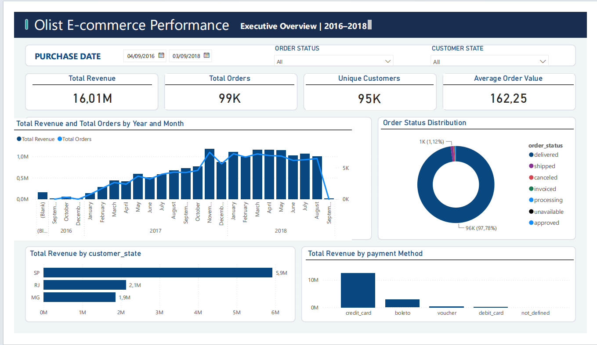
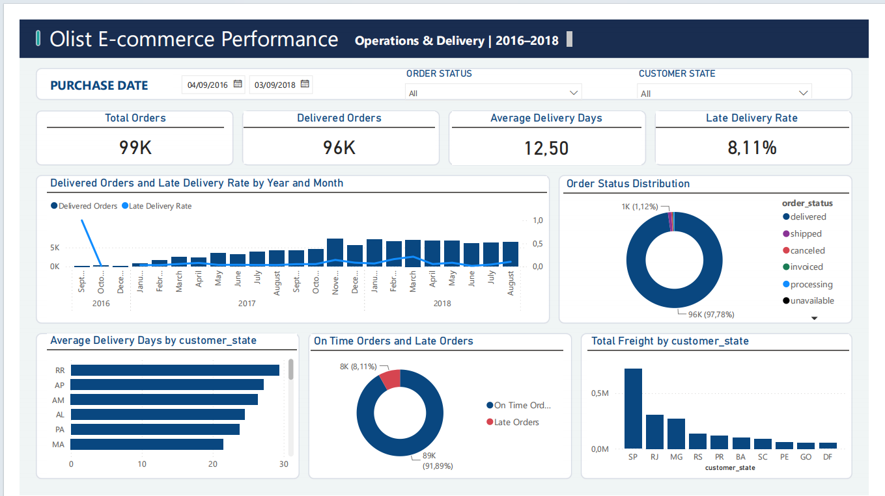
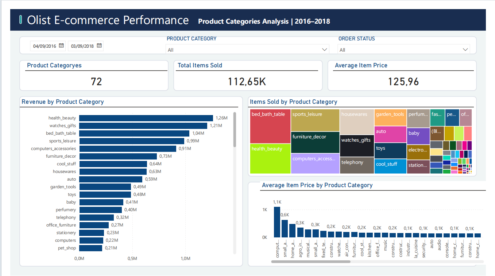
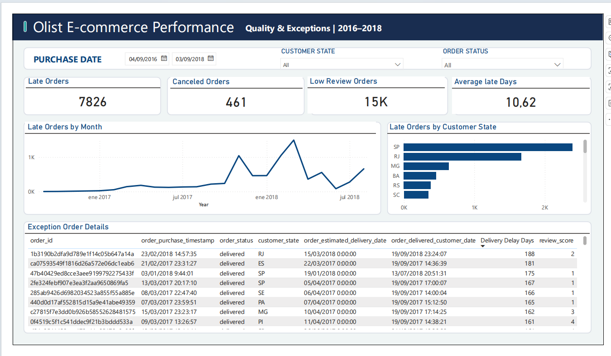

# Brazilian E-Commerce (Olist) – Data Analytics Project

## Project Overview

This project analyzes the Brazilian e-commerce dataset published by Olist. The goal was to build an end-to-end analytics workflow using Python, Pandas and Power BI: from raw CSV files to cleaned datasets, data-quality reports, business KPIs and an interactive dashboard.

The final output is a unified analytical dataset with 112,650 rows, together with a multi-page Power BI report for exploring commercial performance, customers, products, delivery operations and data-quality exceptions.

## Dataset

The project integrates nine related CSV files:

- Customers
- Geolocation
- Orders
- Order items
- Payments
- Reviews
- Products
- Sellers
- Product category translation

The source data contains approximately one million records across all tables, including the geolocation dataset.

## Analytics Pipeline

The project is executed from `run_pipeline.py` in seven stages:

1. Load the raw datasets.
2. Clean and validate each table.
3. Save the cleaned datasets.
4. Export detected data-quality issues.
5. Merge the datasets.
6. Calculate business KPIs.
7. Confirm pipeline completion.

## Data Cleaning and Validation

The main cleaning tasks include:

- ID validation using regular expressions
- Data-type conversion
- Date parsing and validation
- Missing-value analysis
- Text normalization
- Duplicate detection
- Numeric and business-rule validation
- Export of problematic records to separate issue files

Examples of detected issues include invalid geolocation coordinates, missing product information, inconsistent review dates and payment anomalies. These records are preserved in the `Issues` folder for traceability rather than being silently discarded.

## Data Integration

The datasets are merged into a single analytical table through the following main relationships:

- Orders + customers
- Orders + order items
- Orders + payments
- Orders + reviews
- Order items + products
- Products + category translation
- Order items + sellers

Final analytical dataset:

- Rows: 112,650
- Columns: approximately 40
- Unique orders: 99,441 before the one-to-many item merge

## Key Performance Indicators

### Sales and customers

- Revenue by month and state
- Total and unique orders
- Average order value
- Top customers by revenue
- Repeat and one-time customers
- Pareto analysis

### Products

- Revenue by product category
- Items sold by category
- Average item price
- Top products and category contribution

### Operations and quality

- Order-status distribution
- Delivery time and late-delivery rate
- On-time versus late orders
- Freight value by state
- Cancellation rate
- Low-review orders
- Data-quality and delivery exceptions

## Power BI Dashboard

The Power BI report contains eight interactive pages:

1. Executive Overview
2. Trends and Time Analysis
3. Operations and Delivery
4. Product Categories Analysis
5. Geography and Locations
6. Customer Analysis
7. Detail Drillthrough
8. Quality and Exceptions

The report includes date, order-status, state and product-category filters, together with drillthrough navigation for detailed order analysis.

### Dashboard Preview









## Project Structure

```text
olist-ecommerce-analysis/
├── Raw/                  # Original source datasets
├── Clean/                # Cleaned tables and final analytical dataset
├── Issues/               # Exported data-quality exceptions
├── PowerBI/
│   ├── Screenshots/      # Dashboard previews used in this README
│   ├── Olist_Dashboard.pbix
│   └── Olist_Dashboard.pdf
├── cleaning.py           # Dataset-specific cleaning functions
├── config.py             # Paths and source-file configuration
├── helpers.py            # Reusable validation and cleaning helpers
├── merge.py              # Dataset integration
├── kpi.py                # KPI calculations
├── run_pipeline.py       # Complete pipeline entry point
├── requirements.txt
├── .gitignore
└── README.md
```

## Technologies

- Python 3.12
- Pandas
- NumPy
- Power BI
- Power Query
- DAX (selected dashboard measures)
- VS Code

## Running the Project

Install the required Python packages:

```bash
pip install -r requirements.txt
```

Place the original CSV files in `Raw` and run the complete pipeline from the project root:

```bash
python run_pipeline.py
```

The pipeline creates or updates the cleaned datasets in `Clean` and the detected exceptions in `Issues`.

## AI assistance and authorship

The Python data-cleaning pipeline was manually written, tested and progressively refactored by the author. The Power BI report was also built manually without an autonomous coding agent.

AI was used as a learning assistant for technical explanations, code review, debugging suggestions, KPI selection, visual design and Power BI troubleshooting.
## What I Learned

This was my first large multi-table analytics project and helped me move from isolated exercises to a reproducible end-to-end workflow. The main skills developed were data cleaning, validation, multi-table joins, issue traceability, KPI design, pipeline organization and interactive dashboard development in Power BI.
